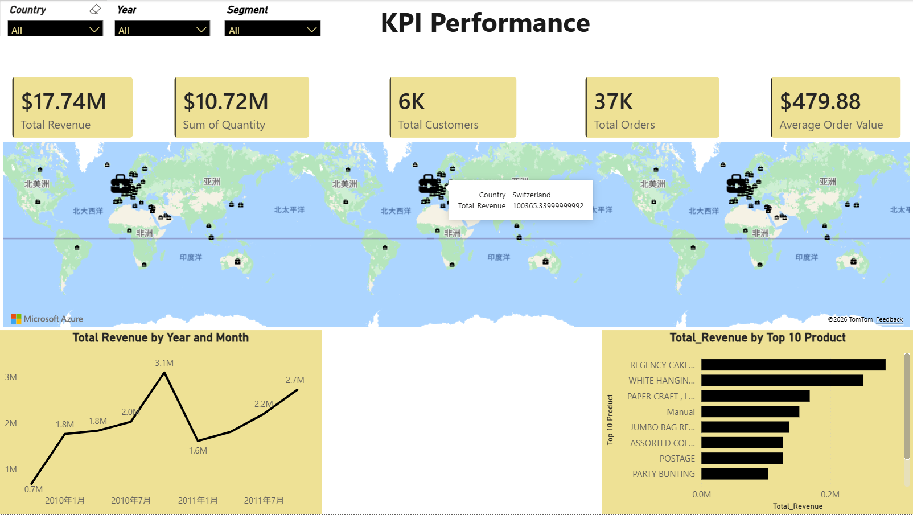
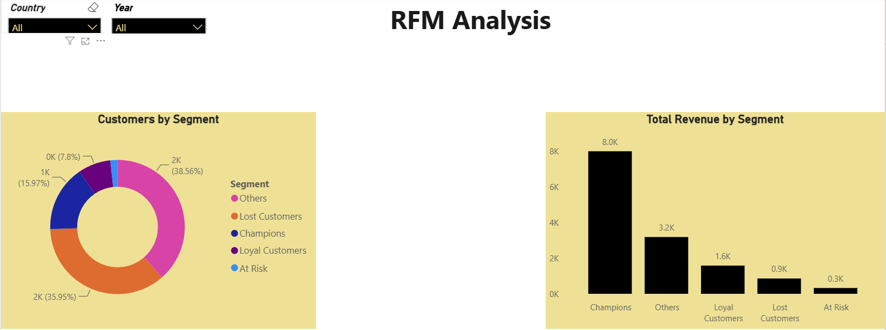

# Retail_Data_Analysis
Built an end-to-end retail analytics solution using MySQL and Power BI. Conducted KPI analysis, customer segmentation using RFM methodology, product performance analysis, and geographic sales analysis to identify revenue drivers, customer retention opportunities, and market concentration risks.

# 📊 Retail Sales Analysis Dashboard

## Project Overview

This project analyzes retail sales transactions from 2009 to 2011 using MySQL and Power BI.

The objective is to identify sales trends, understand customer purchasing behaviour, evaluate product performance, and generate actionable business recommendations through customer segmentation and KPI analysis.

---

## Dataset

- Dataset: Online Retail Transaction Dataset
- Time Period: 2009 - 2011

## Tools

- Excel
- SQL (MySQL)
- Power BI
- GitHub

---

## KPI Dashboard

---

## Customer Segmentation Dashboard

---

## Key Findings

- The business generated approximately **$17.74M** in total revenue.
- Revenue peaked during late 2010, indicating strong holiday season demand.
- Revenue was highly concentrated among a small number of products.
- Champion customers generated the largest share of total revenue despite representing a smaller portion of the customer base.
- A significant number of customers were classified as Lost Customers or At Risk Customers, indicating customer retention opportunities.
- Sales were heavily concentrated in the United Kingdom and several European markets.

---

## Business Recommendations

- Develop loyalty programs to retain Champion and Loyal Customers.
- Launch reactivation campaigns targeting Lost and At Risk Customers.
- Maintain inventory availability for top-performing products.
- Diversify product offerings to reduce revenue concentration risk.
- Increase marketing investment before seasonal sales peaks.
- Explore expansion opportunities in underperforming international markets.

---
